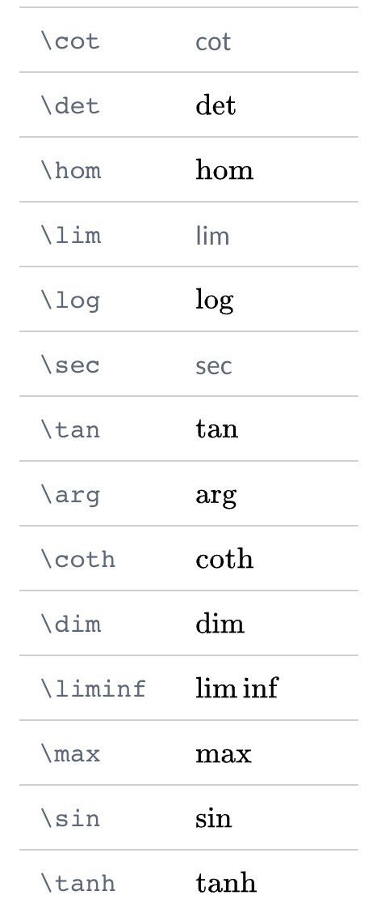

This is copy and test page from [official typora doc](https://support.typora.io/Math/)


Typora supports rendering normal mathematics using `Tex/LaTeX` syntax. The rendering process is processed by [`MathJax`](https://www.mathjax.org/).

[TOC]

# Commands supported by MathJax

http://docs.mathjax.org/en/latest/input/tex/macros/index.html

https://www.onemathematicalcat.org/MathJaxDocumentation/TeXSyntax.htm


# Math Block (Display Math)

Math blocks are `LaTeX` expressions wrapped by `$$` mark and line break, for example:

```Markdown
$$
\begin{align*}
y = y(x,t) &= A e^{i\theta} \\
&= A (\cos \theta + i \sin \theta) \\
&= A (\cos(kx - \omega t) + i \sin(kx - \omega t)) \\
&= A\cos(kx - \omega t) + i A\sin(kx - \omega t)  \\
&= A\cos \Big(\frac{2\pi}{\lambda}x - \frac{2\pi v}{\lambda} t \Big) + i A\sin \Big(\frac{2\pi}{\lambda}x - \frac{2\pi v}{\lambda} t \Big)  \\
&= A\cos \frac{2\pi}{\lambda} (x - v t) + i A\sin \frac{2\pi}{\lambda} (x - v t)
\end{align*}
$$
```

will be rendered as
$$
\begin{align*}
y = y(x,t) &= A e^{i\theta} \\
&= A (\cos \theta + i \sin \theta) \\
&= A (\cos(kx - \omega t) + i \sin(kx - \omega t)) \\
&= A\cos(kx - \omega t) + i A\sin(kx - \omega t)  \\
&= A\cos \Big(\frac{2\pi}{\lambda}x - \frac{2\pi v}{\lambda} t \Big) + i A\sin \Big(\frac{2\pi}{\lambda}x - \frac{2\pi v}{\lambda} t \Big)  \\
&= A\cos \frac{2\pi}{\lambda} (x - v t) + i A\sin \frac{2\pi}{\lambda} (x - v t)
\end{align*}
$$


```
x^{2} + 5x + 8 = 0
```
will be rendered as 

$$
x^{2} + 5x + 8 = 0
$$

## Inline Math

First of all, please enable **inline math** feature from preferences panels -> *Markdown* section. Preferences panel can be opened From menu bar: `File` -> `Preferences...`, or use shortcut key — `command`/`ctrl` + `,`. This setting will be applied after Typora restarts.


Inline math use syntax like this `$<Math Expressions>$`, e.g: `$f = \frac{2 \pi}{T}$`.


This is some test $\frac{2 \pi}{T}$ math expression

## TeX Commands available in Typora

You could find the all supported TeX commands in http://docs.mathjax.org/en/v2.6-latest/tex.html#supported-latex-commands.

You could add new commands using `\def` or`\newcommand`. For example:

```
$$
\def\bold#1

\bold{this\ is\ now\ bold}
$$
```

Followings seems not working 
$$
\def\bold#1

\bold{this\ is\ now\ bold}
$$


## Chemistry Expressions

Typora has the built-in [mhchem](https://mhchem.github.io/MathJax-mhchem/) extension, which can be used to render Chemistry Expressions, you could use like this:

```Markdown
$\ce{CH4 + 2 $\left( \ce{O2 + 79/21 N2} \right)$}$
```

Which will be rendered as

For more details, please refer https://mhchem.github.io/MathJax-mhchem/.

## Auto Numbering

Typora supports auto-numbering math blocks. To turn on this feature, please open preferences panel, and enable “Auto Numbering Math Equations” under the “Markdown” section.


## Troubleshooting

### Force Refresh

When Math rendering goes wrong, like output math too wild/narrow, or equation numbering becomes incorrect, you can trigger force refresh for all math from the `Edit` → `Math Tools` menu.

## Limitations

- MathJax supports a limited subsets of all LaTeX commands (references: http://docs.mathjax.org/en/latest/input/tex/macros/index.html).
- Not all export formats support math, and some commands/features of math/LaTeX would become unavailable after export.

When $a \ne 0$, there are two solutions to $ax^2 + bx + c = 0$ and they are
$$
x = {-b \pm \sqrt{b^2-4ac} \over \frac{2 \pi}{T}}.  \\
$$

Now list 2 price: \$15.0, \$20.1

# Now some quick notes

## Square: $X^2$

## Square root: $\sqrt{100}, \sqrt[3]{x \over y}$

## Divide or fraction 

* $10 \over 21$
* $\frac{10}{21}$

## Next line

$$
This\ is\ first\ line.\\
This\ is\ the\ second\ line.
$$

## Power: $ (25e)^{i\theta} $

## Greeks

(https://www.overleaf.com/learn/latex/List_of_Greek_letters_and_math_symbols)

* $$
  \alpha A \\
  \beta B \\
  \gamma \Gamma \\
  \delta \Delta \\
  \epsilon \varepsilon E \\
  \zeta Z \\
  \eta H\\
  \theta \vartheta \Theta	\\
  \iota I\\
  \kappa K\\
  \lambda \Lambda\\
  \mu M\\
  \nu N\\
  \xi\Xi\\
  o O\\
  \pi \Pi\\
  \rho\varrho P\\
  \sigma \Sigma\\
  \tau T\\
  \upsilon \Upsilon\\
  \phi \varphi \Phi\\
  \chi X\\
  \psi \Psi\\
  \omega \Omega\\
  $$

  
  
## Arrows

$$
{\displaystyle \leftarrow }	\leftarrow	{\displaystyle \Leftarrow }	\Leftarrow\\

  {\displaystyle \rightarrow }	\rightarrow	{\displaystyle \Rightarrow \;}	\Rightarrow\\
  
  {\displaystyle \leftrightarrow }	\leftrightarrow	\\
  {\displaystyle \rightleftharpoons }	\rightleftharpoons\\
  {\displaystyle \uparrow }	\uparrow	{\displaystyle \Uparrow \;}	\Uparrow \\
  {\displaystyle \downarrow }	\downarrow
  {\displaystyle \Downarrow }	\Downarrow \\
  {\displaystyle \Leftrightarrow \;}	\Leftrightarrow	 \\
  {\displaystyle \Updownarrow }	\Updownarrow \\
  {\displaystyle \mapsto }	\mapsto	\\
  {\displaystyle \longmapsto \;}	\longmapsto \\

  {\displaystyle \nearrow }	\nearrow	\\
  {\displaystyle \searrow }	\searrow  \\
  
  {\displaystyle \swarrow }	\swarrow	\\
  {\displaystyle \nwarrow }	\nwarrow\\
  {\displaystyle \leftharpoonup }	\leftharpoonup	{\displaystyle \rightharpoonup }	\\
  \rightharpoonup\\
  
  {\displaystyle \leftharpoondown }	\leftharpoondown	 \\
  {\displaystyle \rightharpoondown }	\rightharpoondown  \\
  \to \\
$$

## Miscellaneous symbols

$$
{\displaystyle \infty \;\;}	\infty	\\
{\displaystyle \forall \;}	\forall  \\
{\displaystyle \Re }	\Re	\\
{\displaystyle \Im }	\Im \\
{\displaystyle \nabla }	\nabla	\\
{\displaystyle \exists }	\exists
{\displaystyle \partial }	\partial	\\
{\displaystyle \nexists }	\nexists
{\displaystyle \emptyset }	\emptyset	\\
{\displaystyle \varnothing \;}	\varnothing \\
{\displaystyle \wp }	\wp	\\
{\displaystyle \complement }	\complement \\
{\displaystyle \neg }	\neg	\\
{\displaystyle \cdots }	\cdots \\
{\displaystyle \square }	\square	\\
{\displaystyle \surd }	\surd \\
{\displaystyle \blacksquare }	\blacksquare	\\
{\displaystyle \triangle }	\triangle \\
$$
  * |  | `\infty`       |  | `\forall`                   |
    | ------------------------------------------------------------ | -------------- | ------------------------------------------------------------ | --------------------------- |
  |  | `\Re`          |  | `\Im`                       |
  |  | `\nabla`       |  | `\exists`                   |
  |  | `\partial`     |  | `\nexists`                  |
  |  | `\emptyset`    |  | `\varnothing`               |
  |  | `\wp`          |  | `\complement`               |
  |  | `\neg`         |  | `\cdots`                    |
  |  | `\square`      |  | `\surd`3                    |
  |  | `\blacksquare` |  | `\triangle`Binary Operators |

## Binary operators
$$
Binary\ operators\	\times \otimes \oplus \cup \cap
$$

## Relation operators

$$
< > \subset \supset \subseteq \supseteq
$$

## Others

$$
\int \oint \sum \prod
$$

## Limits

$\int\limits_5^8(x^2+y^2)dx$

## Subscripts and superscripts

$ a_{21}^2 + a_2^2 = a_3^2 $

$ x^{2 \alpha} - 1 = y_{ij} + y_{ij} $

$\sum_{i=1}^{\infty} \frac{1}{n^s} 
= \prod_p \frac{1}{1 - p^{-s}} $


## Brackets and Parentheses


Type	|LATEX markup	|Renders as
----|----|----
Parentheses; round brackets|	(x+y)	|$(x+y)$ or $\left(x+y\right)$
Brackets; square brackets	|[x+y]	|$[x+y]$
Braces; curly brackets	|\{ x+y \}	| $\{ x+y \}$
Angle brackets	|\langle x+y \rangle	| $\langle x+y \rangle$
Pipes; vertical bars	| \|x+y\| |	$|x+y|$
Double pipes	| \|\|x+y\|\|| $	∥x+y∥$

$F = G ( \frac{m_1 m_2}{r^2} )$

$F = G \left( \frac{m_1 m_2}{r^2} \right)$

## Use align
  When `\left(` and `\right)` are not in the same line, use the invisible `\right.` and `\left.` to pair it in each line

$$
        \begin{align*}
        y  = 1 +  & \left(  \frac{1}{x} + \frac{1}{x^2} + \frac{1}{x^3} + \ldots \right.  \\
   &\quad \left. + \frac{1}{x^{n-1}} + \frac{1}{x^n} \right)
        \end{align*}
$$

## Control sized brackets

$$
\Bigg \langle 3 x +7 \bigg \rangle
$$


## The alignment of using `multiline`
$$
p(x) = 3x^6 + 14x^5y + 590x^4y^2 + 19x^3y^3-3x^6 + 14x^5y + 590x^4y^2 + 19x^3y^3\\ 
- 12x^2y^4 - 12xy^5 + 2y^6 - a^3b^3
$$

$$
\begin{multline*}
p(x) = 3x^6 + 14x^5y + 590x^4y^2 + 19x^3y^3-3x^6 + 14x^5y + 590x^4y^2 + 19x^3y^3\\ 
- 12x^2y^4 - 12xy^5 + 2y^6 - a^3b^3
\end{multline*}
$$


## Aligning several equations

$$
\begin{align*} 
2x - 5y &=  8 \\ 
3x + 9y &=  -12
\end{align*}
$$

$$
\begin{align*}
x&=y           &  w &=z              &  a&=b+c\\
2x&=-y         &  3w&=\frac{1}{2}z   &  a&=b\\
-4 + 5x&=2+y   &  w+2&=-1+w          &  ab&=cb
\end{align*}
$$

## Spacing

$$
\begin{align*} 
\backslash quad & : hello \quad world \\
\backslash , & : hello \, world \\
\backslash : & : hello \: world \\
\backslash ; & : hello \; world \\
\backslash  & : hello \ world \\
\backslash qquad & : hello \qquad world \\


\end{align*}
$$


## Style

* No style
* textstyle
* Script style
* Scriptscript style

In-line maths elements can be set with a different style: $f(x) = \displaystyle \frac{1}{1+x}$. The same is true the other way around:
$$
f(x) = \sum_{i=0}^{n} \frac{a_i}{1+x} \\
\textstyle f(x) = \textstyle \sum_{i=0}^{n} \frac{a_i}{1+x} \\
\scriptstyle f(x) = \scriptstyle \sum_{i=0}^{n} \frac{a_i}{1+x} \\
\scriptscriptstyle f(x) = \scriptscriptstyle \sum_{i=0}^{n} \frac{a_i}{1+x}
$$

## Binomials or choose
$$
\binom{n}{k} = \frac{n!}{k!(n-k)!} \\
{n+1 \choose 2k}
$$

## Sin , Cos

$$
\sin(a + b) = \sin a \cos b + \cos a \sin b
$$

col1 | col2
-----|-----
 |  

## Compare and Not euqal


$$
a\gvertneqq b\\
c \neq b \\
\lt \gt \le \leq \leqq \leqslant \ge \geq \geqq \geqslant \neq
$$


## Fonts


* blackboard bold

$$
\Bbb{ABCDEFGHIJKLMNOPQRSTUVWXYZABCDEFGHIJKLMNOPQRSTUVWXYZ} \\ 
\mathbb{ABCDEFGHIJKLMNOPQRSTUVWXYZABCDEFGHIJKLMNOPQRSTUVWXYZ}
$$

* boldface
  $$
  \mathbf{𝐀𝐁𝐂𝐃𝐄𝐅𝐆𝐇𝐈𝐉𝐊𝐋𝐌𝐍𝐎𝐏𝐐𝐑𝐒𝐓𝐔𝐕𝐖𝐗𝐘𝐙  𝐚𝐛𝐜𝐝𝐞𝐟𝐠𝐡𝐢𝐣𝐤𝐥𝐦𝐧𝐨𝐩𝐪𝐫𝐬𝐭𝐮𝐯𝐰𝐱𝐲𝐳.}
  $$

* Bold symbol: $\boldsymbol{\alpha}$

* Italics $\mathit{ABCDEFGHIJKLMNOPQRSTUVWXYZABCDEFGHIJKLMNOPQRSTUVWXYZ abcdefghijklmnopqrstuvwxyz}$

* bold face italics: $\pmb{𝐴𝐵𝐶𝐷𝐸𝐹𝐺𝐻𝐼𝐽𝐾𝐿𝑀𝑁𝑂𝑃𝑄𝑅𝑆𝑇𝑈𝑉𝑊𝑋𝑌𝑍𝐴𝐵𝐶𝐷𝐸𝐹𝐺𝐻𝐼𝐽𝐾𝐿𝑀𝑁𝑂𝑃𝑄𝑅𝑆𝑇𝑈𝑉𝑊𝑋𝑌𝑍ABCDEFGHIJKLMNOPQRSTUVWXYZABCDEFGHIJKLMNOPQRSTUVWXYZ 𝑎𝑏𝑐𝑑𝑒𝑓𝑔ℎ𝑖𝑗𝑘𝑙𝑚𝑛𝑜𝑝𝑞𝑟𝑠𝑡𝑢𝑣𝑤𝑥𝑦𝑧𝑎𝑏𝑐𝑑𝑒𝑓𝑔ℎ𝑖𝑗𝑘𝑙𝑚𝑛𝑜𝑝𝑞𝑟𝑠𝑡𝑢𝑣𝑤𝑥𝑦𝑧abcdefghijklmnopqrstuvwxyzabcdefghijklmnopqrstuvwxyz}$

* Type writer: $\mathtt{𝙰𝙱𝙲𝙳𝙴𝙵𝙶𝙷𝙸𝙹𝙺𝙻𝙼𝙽𝙾𝙿𝚀𝚁𝚂𝚃𝚄𝚅𝚆𝚇𝚈𝚉ABCDEFGHIJKLMNOPQRSTUVWXYZ 𝚊𝚋𝚌𝚍𝚎𝚏𝚐𝚑𝚒𝚓𝚔𝚕𝚖𝚗𝚘𝚙𝚚𝚛𝚜𝚝𝚞𝚟𝚠𝚡𝚢𝚣}$

* Roman font: $\mathrm{ABCDEFGHIJKLMNOPQRSTUVWXYZABCDEFGHIJKLMNOPQRSTUVWXYZ abcdefghijklmnopqrstuvwxyzabcdefghijklmnopqrstuvwxyz}$

* sans-serif font: $\mathsf{𝖠𝖡𝖢𝖣𝖤𝖥𝖦𝖧𝖨𝖩𝖪𝖫𝖬𝖭𝖮𝖯𝖰𝖱𝖲𝖳𝖴𝖵𝖶𝖷𝖸𝖹ABCDEFGHIJKLMNOPQRSTUVWXYZ 𝖺𝖻𝖼𝖽𝖾𝖿𝗀𝗁𝗂𝗃𝗄𝗅𝗆𝗇𝗈𝗉𝗊𝗋𝗌𝗍𝗎𝗏𝗐𝗑𝗒𝗓}$

* calligraphic: $\mathcal{ABCDEFGHIJKLMNOPQRSTUVWXYZ 𝖺𝖻𝖼𝖽𝖾𝖿𝗀𝗁𝗂𝗃𝗄𝗅𝗆𝗇𝗈𝗉𝗊𝗋𝗌𝗍𝗎𝗏𝗐𝗑𝗒𝗓}$

* script letters: $\mathscr{ABCDEFGHIJKLMNOPQRSTUVWXYZ 𝖺𝖻𝖼𝖽𝖾𝖿𝗀𝗁𝗂𝗃𝗄𝗅𝗆𝗇𝗈𝗉𝗊𝗋𝗌𝗍𝗎𝗏𝗐𝗑𝗒𝗓}$

  ## 加减乘除：
  $ \times \div \pm \mp$

  ## Central dot: 

  $x \dot y, x \cdot y $

  ## Set

  ## $\cup \cap \setminus \subset \subseteq \subsetneq \supset \in \notin \emptyset \varnothing$

  ## And or not, forall, exists, ... 

  $ \land \lor \lnot \forall \exists \top \bot \vdash \vDash$


## `\approx \sim \simeq \cong \equiv \prec \lhd \therefore` 
$\approx \sim \simeq \cong \equiv \prec \lhd \therefore$

## `\infty \aleph_0` ∞ℵ0 `\nabla \partial` ∇, ∂ `\Im \Re` ℑ, ℜ

## $a\equiv b\pmod n, a\equiv b, \pmod n$

## dots

$$
a_1 + a_2 + \ldots, a_n \\
a_1 + a_2 + \cdots, a_n \\
$$

