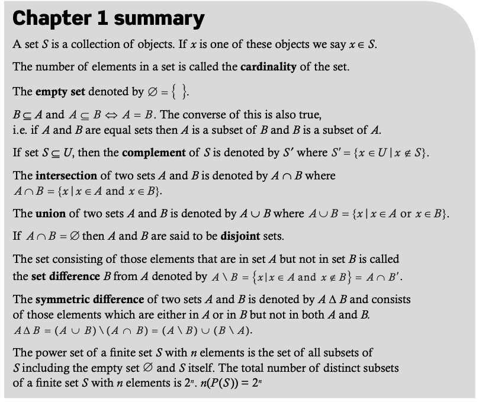

# CH1. The development of Set Theory 

## Before you start

for any $ax^2 + bx+c = 0$, if $x_1, x_2$ is the root the of equation, then

$$
x_1 + x_2 = - \frac{b}{a}\\
x_1x_2 = {c \over a}
$$

## Set definitions and operations

A set **S** is a collection of objects, and if **x** is one of these objects we say that **x** is an element of **S**. We denote this by $x \in S$.

The number of elements in a set **S** is called the **cardinality** of the set and we will denote it by $n(S)$. In some books it is denoted by
 $card (S) $ or $| S|$ .

**Empty set,** denoted by $ \varnothing = \{\}$.

**Definition**

* A set S is said to be **well-defined** if for any given x, we can determine if x belongs to the set.

* The empty set $\varnothing$ is a subset of any given set. We say that $\varnothing$ is a trivial subset. Another trivial subset of any given set is the set itself.

* $\Leftrightarrow$ is the notation used for *if and only if*. Whenever we need
   to prove a statement containing $\Leftrightarrow$  we need to prove both ways, i.e. $\Leftarrow$ and $\Rightarrow$

* A set containing all the elements under discussion is called the **universal set** and is denoted by U.

* If set S $\subseteq$ U, then the complement of S, denoted by $S^{'}$,

* The **intersection** of two sets A and B, denoted by A $\cap$ B, is made

  up of those elements which are in both A and in B,

* The **union** of two sets A and B, denoted by A $\cup$ B, is made up of those elements which are either in A, in B, or in both A and B,

* If A $\cap$ B = $\varnothing$ then A and B are said to be **disjoint sets**.

* The set consisting of those elements that are in set A but not in set B is called the **set diference B from A** denoted by $A \backslash B$, you can prove that $A \backslash B =  A \cap B^{'}$

* The **symmetric diference** of two sets A and B is denoted by A $\Delta$ B and consists of those elements which are either in A, in B, but not in both A and B,

$i.e. A \Delta B = \ \{ x| x \in A\ or\ x\ \in B, x \notin A \cap B\} = (A \backslash B) \cup (B \backslash A)$

## Partions and Venn Diagrams

## Venn diagrams and set properties

## The Cartesian product of two sets

In mathematics, a Cartesian product is a method which allows us to construct a new set of **multiple dimensions** by combining multiple sets.

For example if we take the Cartesian product ofthe sets $\Bbb R \times \Bbb R  \times \Bbb R$
 we obtain a **three-dimensional set** we are familiar with, namely the **three-dimensional set of ordered triplets** which was used when studying vectors in three dimensions. 

Definition

---

The **Cartesian product** of two **non-empty sets** A and B denoted by $A\ \times\ B$ is the set of **all ordered pairs (a, b)** where $a \in A$ and $b \in B$.

In *set-builder notation*,$A\times B=\{(a,b)| a \in A,b \in B \}$

Clearly you can see that $A \times B \ne B \times A$.

It is usual to denote the Cartesian product of a set A with itself as $A^2$. So $\Bbb R \times \Bbb R=\Bbb R^2$,  and $\Bbb Z \times \Bbb Z =\Bbb Z^2$.

The three dimensional Cartesian coordinate system, also known as Euclidean space, is represented by $\Bbb R \times \Bbb R \times \Bbb R =\Bbb R^3$.

You should have noticed rom the previous examples the ollowing points:

1.  The Cartesian product of two sets is a set.
2.  The elements of the set are ordered pairs.
3.  In each ordered pair, the frst element comes from the frst set and the second element comes from the second set.

## Relations

* Actually a relation **does not have to be** governed by a rule. Any random subset of $A \times  A$ is a relation on A whether or not it describes a rule.

* **Inverse**

  * 

  注意，$bR^{-1}a \Leftrightarrow aRb$

* 

- Equivalence: 等价关系

  - Reflexive: 自反关系: 
    - 
  - Symmetric: 对称关系
  - Transitive: 传递关系

  

* $x, y \in Z$ are said to be **congruent modulo**(同余) n, if $| x - y|$ is divisible by n. We denote this by   $x \equiv  y \pmod {n}$. It is an **equivlence relation**, like $x \equiv 1 \pmod{5},\ y \equiv 1 \pmod {6}$
  * 
  * 

## Equivalence classes and partitions

* Theorem 6

  **Equivalence classes** formed by an **equivalence relation** on a set A are **disjoint**, and their union is A.

## Chapter 1 summary

